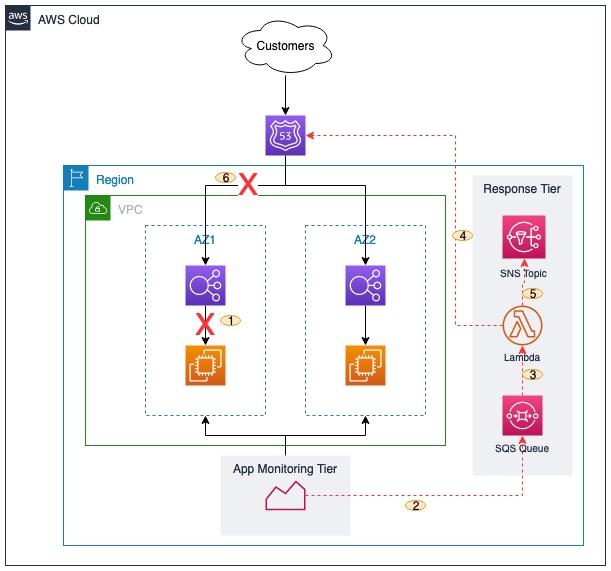

# Route53 ARC Zonal Shift

This project creates a Lambda function, an SQS queue, and an SNS Topic. The Lambda function is triggered \
by a message published to the SQS queue. The Lambda function makes an API call to start Zonal Shift and 
sends a success or failure message to the SNS topic

||
|:--:|
| Figure 1. Automated Zonal Shift Diagram |

## Solution Workflow

1. A Gray Failure has occured in an Availability Zone.
2. The Application monitoring mechanism detects it and sends a message to an SQS queue.
3. The SQS `queue` triggers a Lambda Function with information about the degraded AZ.
4. The Lambda `function` makes an API call to start `Route53 ARC Zonal Shift`.
5. The Lambda function publishes a message to an SNS `topic` for notification.
6. Route53 ARC Zonal Shift shifts traffic from the degraded AZ.

## Deployment Steps

1. Ensure CDK is installed
```
$ npm install -g aws-cdk
```

2. Create a Python virtual environment

```
$ python3 -m venv .venv
```

3. Activate virtual environment

_On MacOS or Linux_
```
$ source .venv/bin/activate
```

_On Windows_
```
% .venv\Scripts\activate.bat
```

4. Install the required dependencies.

```
$ pip install -r requirements.txt
```

5. Synthesize (`cdk synth`) or deploy (`cdk deploy`) the example

```
$ cdk deploy
```

## Testing the Solution
1. From the root directory change to src/sample.
```
$ cd src/sample
```
2. Edit the payload.json file to reflect your load balance. 
Do not change the key.
```
vi payload.json
```
3. Save the file and run the command below
```
$ aws sqs send-message --message-body file://payload.json
```

## Cleaning Up

```
$ cdk destroy
