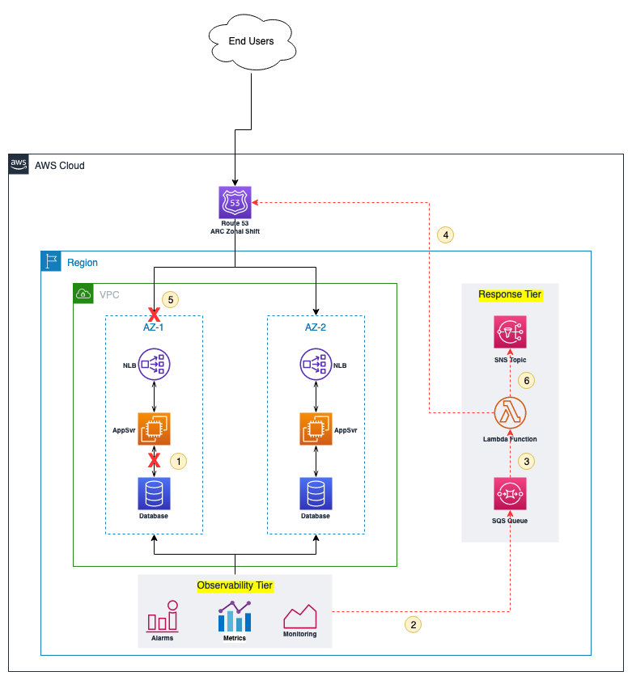
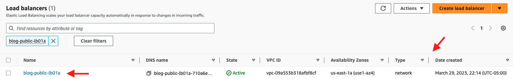
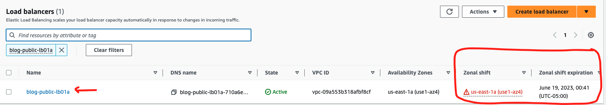

# Route53 ARC Zonal Shift

This project creates a Lambda function, an SQS queue, and an SNS Topic. The Lambda function is triggered \
by a message published to the SQS queue. The Lambda function makes an API call to start Zonal Shift and 
sends a success or failure message to the SNS topic



## Solution Workflow

1. The App Server lost network access to the Database. The NLB still sees the App Server as healthy and continues to send requests to it. Client requests are failing with 5XX errors. A Gray Failure has occurred in the AZ.
2. The Application monitoring mechanism detects the gray failure. A message is sent to the SQS queue.
3. The SQS queue triggers a Lambda Function with information about the degraded AZ.
4. The Lambda function makes an API call to start Route 53 ARC Zonal Shift.
5. Route 53 ARC Zonal Shift shifts traffic from the degraded AZ.
6. The Lambda function publishes a message to an SNS topic for notification.

## Deployment Steps

1. Ensure CDK is installed
```
$ npm install -g aws-cdk
```

2. Create a Python virtual environment

```
$ python3 -m venv .venv
```

3. Activate virtual environment

_On MacOS or Linux_
```
$ source .venv/bin/activate
```

_On Windows_
```
% .venv\Scripts\activate.bat
```

4. Install the required dependencies.

```
$ pip install -r requirements.txt
```

5. Synthesize (`cdk synth`) or deploy (`cdk deploy`) the example

```
$ cdk deploy
```

## Testing the Solution
1. From the root directory change to src/sample.

    ```bash
    cd src/sample
    ```

2. Edit the payload.json file to reflect your load balancer's name.
`DO NOT` change the Key.

    ```bash
    vi payload.json
    ```

3. Log into the AWS console, navigate to the Load Balancer page and note the status of the NLB as indicated below. Note that there is no column labelled for Zonal Shift.

   

4. Switch to the CloudFormation service page. In the Outputs tab, copy the value of the `QueueUrl` and replace the placeholder QUEUE_URL_HERE in the command in step 5.

5. Trigger the Zonal Shift by running the command below

    ```bash
    aws sqs send-message --queue-url *QUEUE_URL_HERE* --message-body file://payload.json
    ```

6. To verify the shift, log back into the Load Balancer page in the AWS Console and verify the status of the NLB. Note that new columns have appeared for Zonal Shift as indicated below.

   
```

## Cleaning Up

```
$ cdk destroy

## Security

See [CONTRIBUTING](CONTRIBUTING.md#security-issue-notifications) for more information.

## License

This library is licensed under the MIT-0 License. See the LICENSE file.
